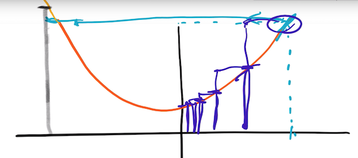
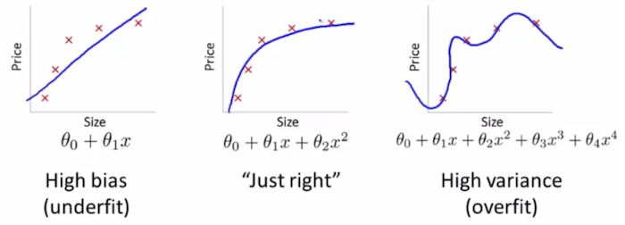
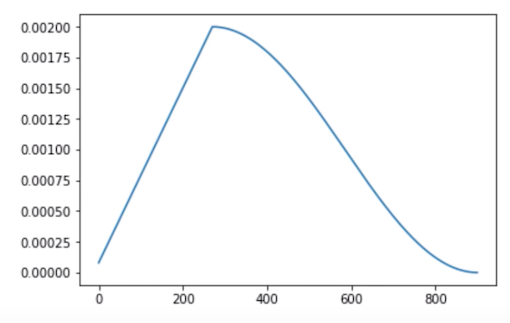
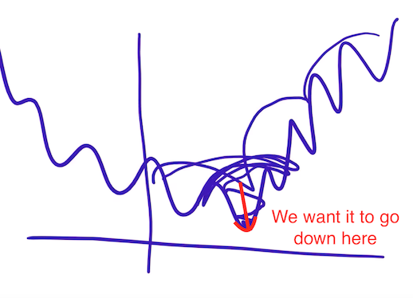
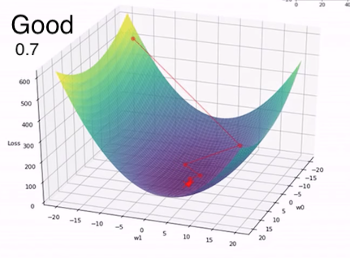
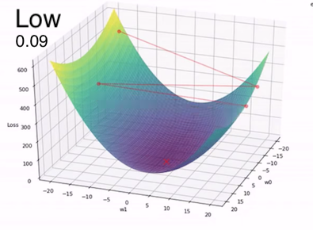
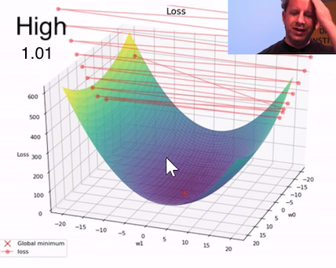
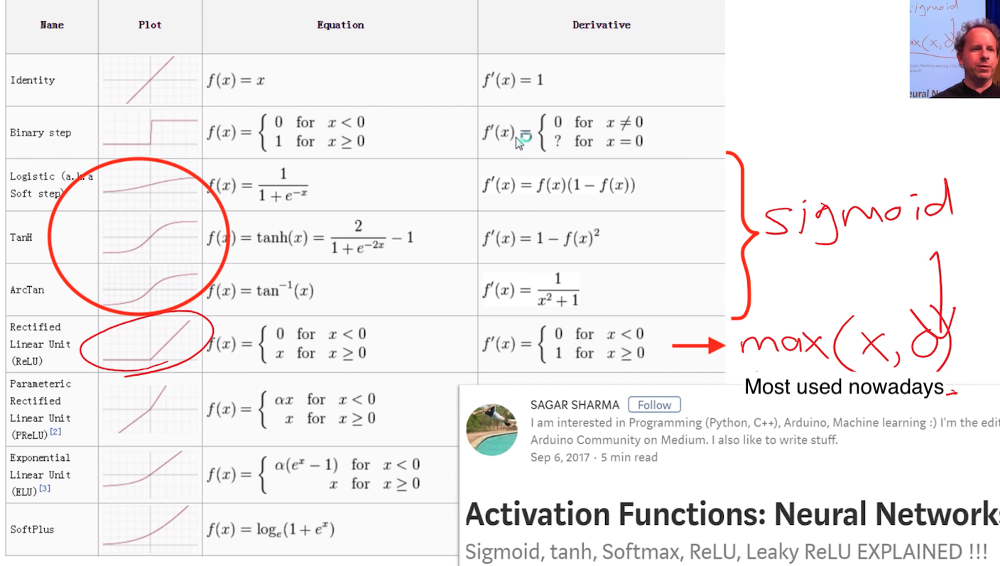

# Theory

**"Predictors are functions of pixel values"**

## How a computer predicts images

A Black and White image is a map of numbers (pixels 0 - 255).

A color picture has a third dimension (RGB). **When it has an extra dimension it is called "tensor".**

The model creates a function that takes the numbers in the image and returns a probability of being any of the trained classes.

### functions

A linear function 

1. `y = a x + b`
2. `y = a x1 + b x2`
3. `y = a1 x1 + a2 x2`
   
A scatter plot is a lot of dots distributed over a grid.
Each dot is a `y` and `x`. We can write it like this:

`yi = a1 xi,1 + a2 xi,2`

This is a matrix multiplication.
In this case a matrix `n x 2` * `2 x 1`: 

`[[x1,1  x1,2], [x2,1  x2,2]]` x `[[a1], [a2]]` = `[y1, y2]`

> Matrix mutiplication: http://matrixmultiplication.xyz/

This can be written as (this is an "architecture", a very simple one):

`ȳ = X ā`

> Pytorch does not like loops. Send a whole bunch of data and a linear algebra function and it works faster.

The model is just a set of coefficients that works for the data set.

> `resnet34` is just a function. It does not store anything, it is just a function.

### Learning rate

The learning rate is how much the model jumps from one point to the other trying to find the "optimal" point.

For example, if you have a quadratic function and wants to find the minimal point, you could start somewhere, calculate the derivative and move a little to where the tangent line points to. The learning rate is how much you jump. If the learning rate is too high, the jump will go too far and the model will possibly never fit. If it is too low, it will jump too little and it will take longer to fit, if it fits at all.

Showing how the learning rate changes the loss: [Video](https://youtu.be/MpZxV6DVsmM?t=4736)

#### Stochastic Gradient Descent (SGD)

Optimization method commonly used in neural networks.

### Underfitting / Overfitting

## Fit one cycle

It start with the learning rate low, then increases it, then lower it again. We want the LR to decrease in the end to get closer to the optimized loss function.

Showing how the learning rate changes the loss: [Video](https://youtu.be/MpZxV6DVsmM?t=4736)

## Metrics (activation functions)

